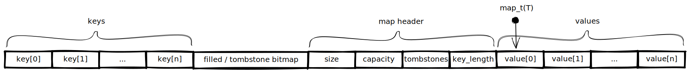

Hash Map
========

A generic hashmap using open addressing and linear probing.
Automatically doubles in size when 75% of the buckets are filled.
Values are typesafe, keys are supplied through void pointers.

Usage
-----

Memory layout
-------------

