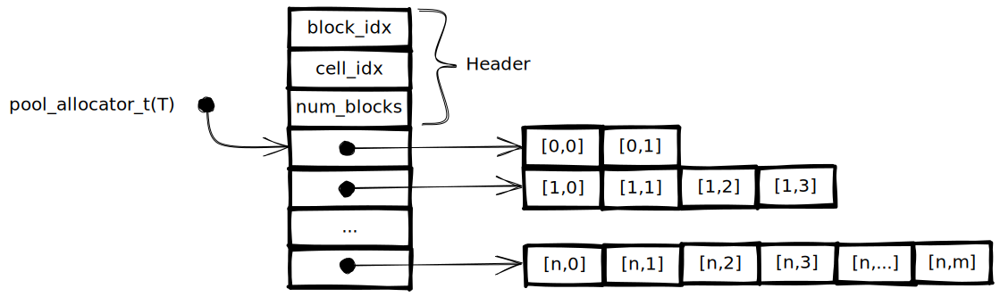

Generic memory pool
===================

A typesafe pool allocator.
Can be used to manage memory for elements of the same type while providing fast allocation times and no internal fragmentation.

Usage
-----

``` c
pool_allocator_t(uint64_t) allocator = new_pool_allocator(uint64_t);
uint64_t *cell = poolalloc(allocator);
poolfree(cell);
pool_allocator_clear(allocator);
```

Memory layout
-------------

A `pool_allocator_t(T)` is a pointer to an array of `T*`.
In front of that array the `block_idx` and `cell_idx`, which specify the head of the free list, are stored.
Each `T*` in the array points to an array of `T` from which memory is allocated.
Empty cells are managed using a freelist, `block_idx` and `cell_idx` specify its head.

To minimize the memory overhead when only a few elements are allocated, the first memory blocks are much smaller than the later ones.


