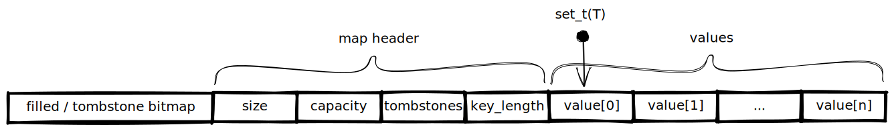

Hash Set
========

A generic hash set.
The hash set offers constant time lookup, insertion, and removal of items.
Capacity is automatically increased as needed.
Metadata is stored in front of the pointer to the data.

Usage
-----

Create a hashset of custom structs with an initial capacity of ten items.
``` c
struct MyStruct {
  int a;
  int b;
};

set_t(MyStruct) my_set = set_create(MyStruct, 10, NULL, NULL);
```

Add an element to the set.
``` c
set_add(my_set, (MyStruct){.a = 1, .b = 2});
```

Check whether a certain element is in the set.
``` c
if (set_has(my_set, (MyStruct){.a = 1, .b = 2})) { ... }
```

Remove an element from the set.
``` c
set_remove(my_set, (MyStruct){.a = 1, .b = 2});
```

Get an element from the set.
This only really makes sense if you provide custom hash and equality functions which only use part of the values.
``` c
MyStruct my_struct = set_get(my_set, (MyStruct){.a = 1, .b = 2});
```


Memory layout
-------------


