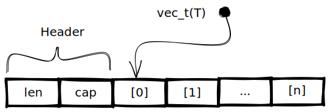

Vector
======

A typesafe generic dynamic array.
Automatically doubles in size when its capacity is exceeded.

Usage
-----

Create a vector of ints with an initial capacity of ten and a length of zero.
``` c
vec_t(int) vector = vec_create(int, 10);
```

Append a value to the vector, resizing it if necessary.
``` c
vec_push(vector, 1234);
```

To access the vectors values, you can use the same subscript operator used for regular arrays.
This also means a vector is compatible with pretty much all functions which expect a regular array.
``` c
if (vector[0] == 1234) { ... }
vector[0] = 123;
```

However, there are also safe alternative to access the values of a vector.
These make use of fact that the length is known at runtime and add assertions to catch out of bounds accesses during debugging.
``` c
if (vec_get(vector, 0) == 1234) { ... }
vec_set(vector, 0, 123);
```

Access the capacity (number of slots) and the length (number of filled slots).
``` c
size_t capacity = vec_cap(vector);
size_t length = vec_len(vector);
```

Ensure the vector has sufficient capacity to store 100 items
``` c
vec_reserve(vector, 100);
```

Sort the vector using quicksort:
``` c
int int_compare(int *a, int *b) {
  return *a - *b;
}

vec_qsort(vector, int_compare);
```

Search through the elements of an ordered vector using binary search.
If there is no result, the function returns a null pointer.
Note that the search key must be a pointer.
``` c
int *result = vec_bsearch(vector, &(int){3}, int_compare);
```

Memory layout
-------------

A `vec_t(T)` is simply a `T*` which points to some heap allocated memory.
The length and capacity are stored in front of that pointer.


